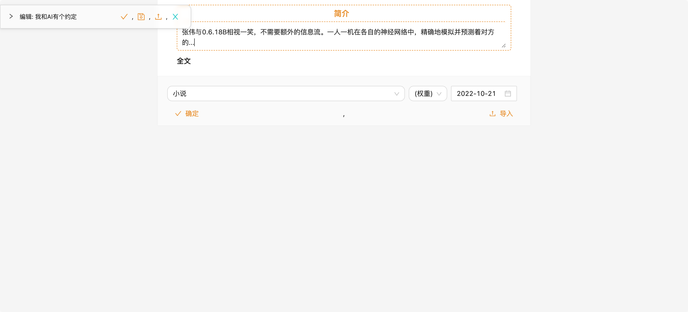

# 快速开始

## 启动

你只需要一台装有docker的电脑，然后（在scripts目录中）运行
```sh
bash deploy
```
然后就可以打开网址`https://localhost/`访问

> 启动脚本默认使用自签名证书，你也可以替换自己的证书（见：[部署脚本](./SCRIPT.md)）


## 第一篇文章

* 初始的网址没有任何内容，先登陆
  * 依次点击：（左上角）菜单-》关于-》管理员登陆，进入登陆界
    * 
    * 
    * 
  * 输入用户名及密码（默认用户名`adm`, 密码`123456`）
* 再配置主题，主题是你文章的目录
   * 依次点击： 菜单-》管理-》主题，进入主题管理界面
     * 
   * 点击按钮添加主题（例入：小说）
     * 
   * 依次点击： 菜单-》配置，进入配置界面，新添加的根主题需要配置才能显示在菜单中，不同的根主题有不同的配置
     * 
   * 点击`插件`修改按钮并添加`Blog,小说`，刷新页面以应用配置
     * 
     * 
   * 点击`小说:文章段`修改按钮，将其修改为`简介;_全文`，此主题的页面将拥有两个部分，简介部分将显示在页面列表中
   * 刷新页面以应用配置，现在你的页面主题小说已经添加成功，通过菜单即可进入此主题
     * 
* 添加页面
  * 点击浮动菜单按钮，在弹出界面中点击添加按钮，输入页面名称（例入我和AI有个约会）
    * 
    * 
    * 
  * 编辑并保存页面，小说目录与首页已经有了新添加的页面
    * 
